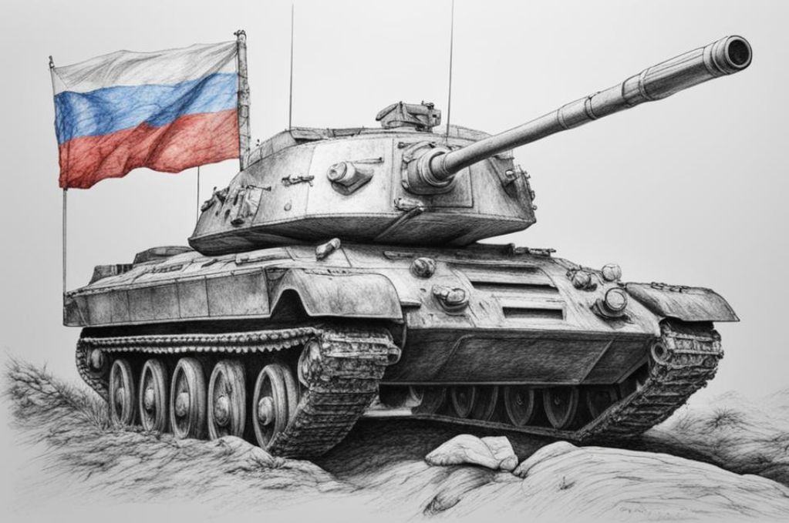

## World of Tanks: Руководство для начинающих

**Добро пожаловать в мир танковых сражений!**

Это руководство поможет вам освоить основы World of Tanks и начать свое путешествие к танковому величию.

**Что такое World of Tanks?**

World of Tanks — это многопользовательская онлайн-игра, в которой игроки управляют исторически точными танками и сражаются друг с другом в командных боях.

**Как начать играть:**

1. Создайте бесплатную учетную запись на официальном сайте.
2. Загрузите и установите игровой клиент.
3. Запустите игру и войдите в свою учетную запись.

**Основы геймплея:**

* Выберите танк из более чем 600 моделей.
* Присоединяйтесь к команде из 15 игроков.
* Захватывайте базы противника.
* Уничтожайте вражеские танки.

**Прогресс и улучшение:**

* Исследуйте новые танки.
* Модернизируйте свои танки.
* Нанимайте и тренируйте экипаж.

**Советы для начинающих:**

* Изучите основы.
* Выберите правильный танк.
* Работайте в команде.
* Практикуйтесь.

**Заключение:**

С помощью этого руководства вы сможете начать свое путешествие в World of Tanks с уверенностью. Практикуйтесь, улучшайте свои навыки и наслаждайтесь захватывающим миром танковых сражений.
